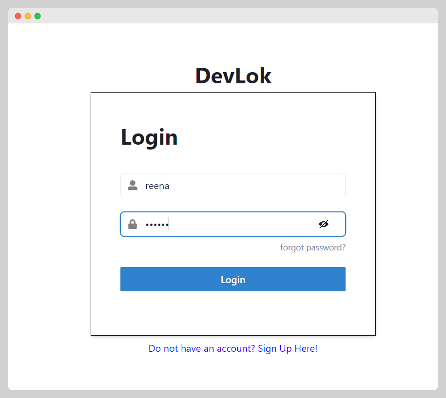
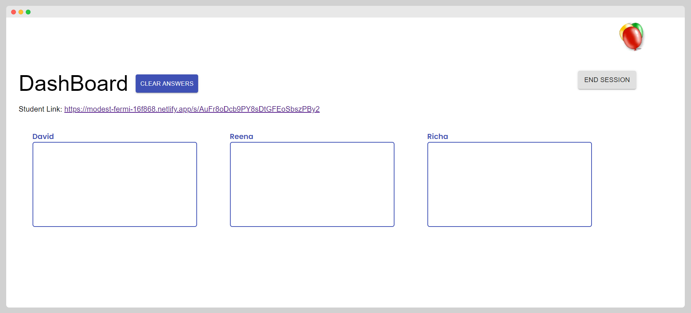
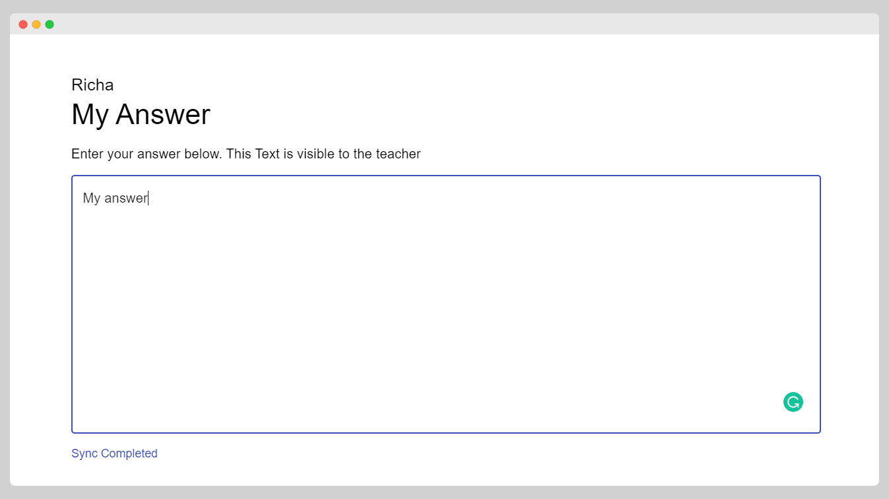
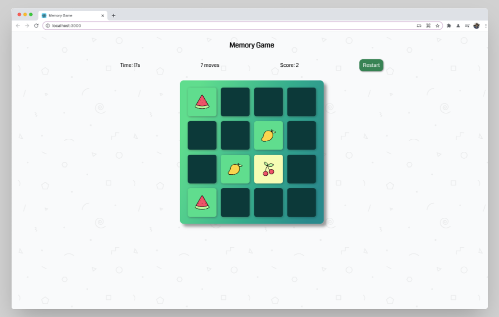
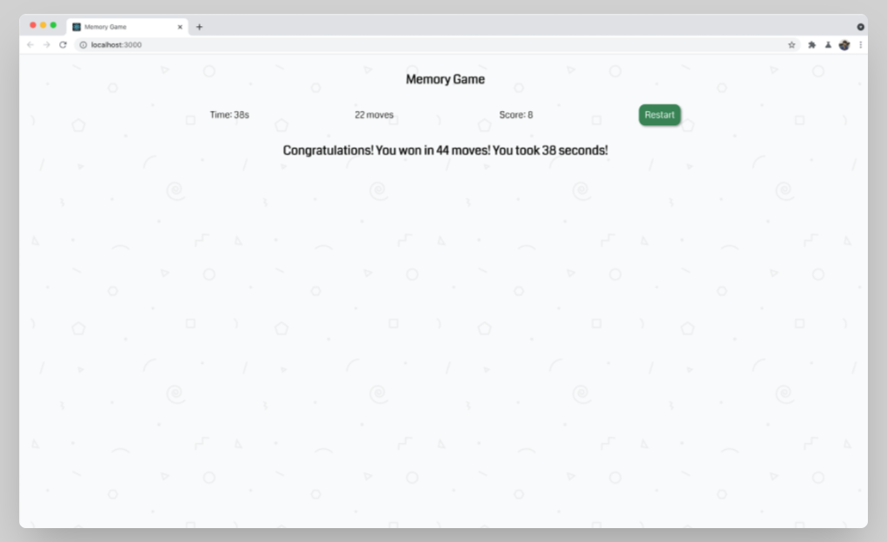

 Hi, I’m Reena Mehta,a full-stack web developer. My core skill sets include MongoDB, ExpressJS, ReactJS, NodeJS, Firebase, Java J2EE, and Oracle. Intend to have a career in an organization with committed and dedicated people, which would explore my potential to its maximum and also evolve me as a professional having an excellent skill set and help me rise in my career.

Here are some of the major projects I have build! 🚀🚀

## DevLok: Social Media Website | [Website link](https://app.netlify.com/sites/friendly-blackwell-086f20/overview) | [GitHub Repo](https://github.com/mehtaReena/Social-Media-Backend) | [GitHub Repo](https://github.com/mehtaReena/SocialMediaFrontend)

It is a social media website design for people to share their thoughts.Including authentication, and used JWT for authorization. You can follow other users.You can like a post, view other users’ profile and unfollow them if you want.
    
   **DevLok Login Page**

**DevLok Profile Page**

## Everyone Answers (Firebase) | [Website link](https://modest-fermi-16f868.netlify.app) | [GitHub Repo](https://github.com/mehtaReena/Capstone-Project)
It is an app created for teachers to get response in real time from students in a live online class.
Teacher can create a session, add students and can share a unique link with students.
When a student opens the portal and answers something, it appears on the teacher's dashboard real time.
**Everyone Answers Login Page**

**Everyone Answers Dashboard**

**Everyone Answers Student Page**

## Memory Game with React | [Website link](https://heuristic-snyder-bb76cf.netlify.app) | [GitHub Repo](https://github.com/McLaren-College/day-23-memory-game-project-mehtaReena)
Created a fun time-based memory game using ReactJS.
Using multiple timers on the same page was a challenge.

**On Going Memory Game**

**Final result  page**

